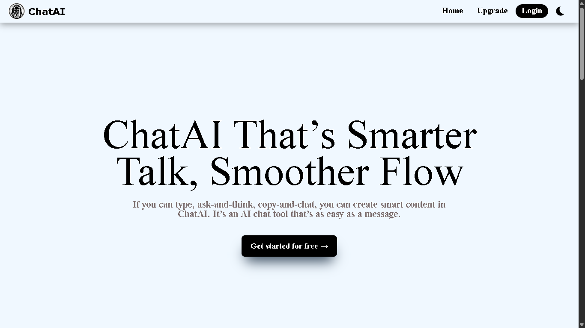
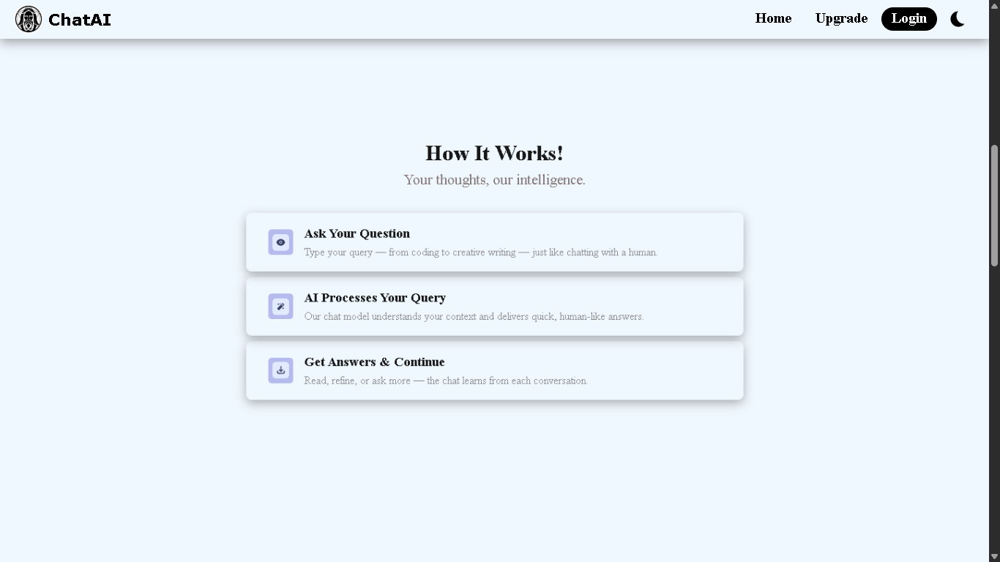
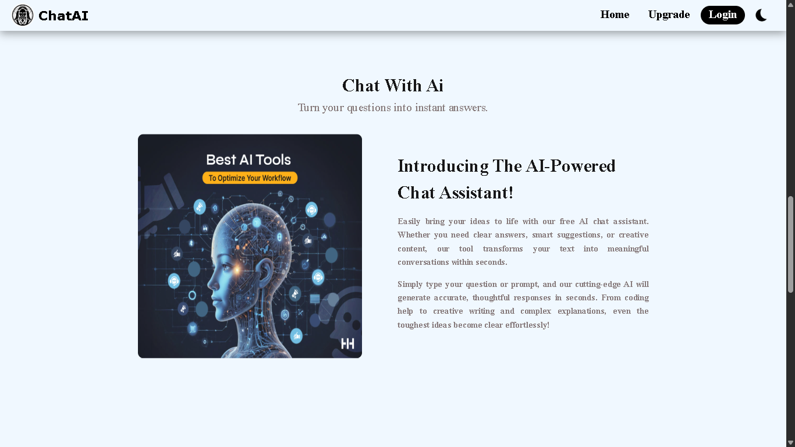
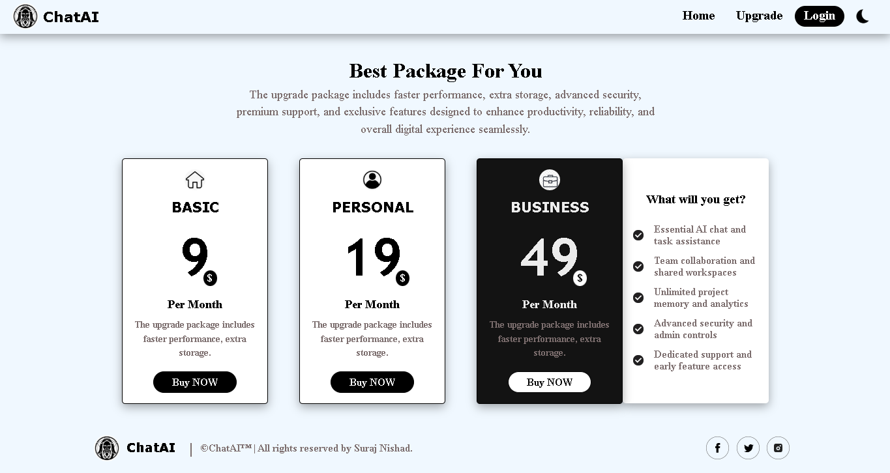

# ChatAI Project

## 🚀 Overview
**ChatAI** is an **intelligent** chatbot that enables natural, context-aware conversations using advanced **AI models**. It’s designed to understand user intent, provide accurate responses, and adapt to various use cases like support, learning, or automation. Built for **flexibility**, **ChatAI** can be easily integrated into web or mobile platforms for a seamless **conversational** experience.

---

## 🛠 Tech Stack
### **Frontend**
- React
- Axios

### **Backend**
- Node.js & Express.Js
- REST API

### **Database**
- MongoDB

### **Others**
- Cloud Storage (MongDb ATLAS)
- Deployment: Netlify (frontend) & Render (backend)
- Gimini API (integration for intelligent user responses)
- Google authentication (for easy signup and login)

---

## ✨ Features
### Frontend
- Interactive chat UI for real-time conversations.
- One-click **Google authentication** for easy sign-in and sign-up.
- Dynamic AI responses powered by the **Gemini API**.
- Fully responsive design for desktop and mobile devices.
- Integrated dark theme for enhanced visual experience.

### Backend
- RESTful API with USER signup & signin functinalities
- Authentication & Authorization (JWT)
- Secure data handling & validations

---

## 📂 Project Structure
```
project-root/
│
├── ChatAI_Client/       # Frontend code (React)
├── ChatAI_Server/       # Backend code (Node.js/Express.js)
└── README.md     # This file
```

---

## ⚙️ Installation & Setup
Clone the repository:
```bash
git clone https://github.com/Suraj-nishad78/ChatAI
cd ChatAI
```

### **Frontend Setup**
```bash
cd ChatAI_Client
npm install
npm run dev
```

### **Backend Setup**
```bash
cd ChatAI_Server
npm install
node index
```

---

## 🔑 Environment Variables
Create a `.env` file in both `frontend` and `backend` directories with the following variables:

### Frontend `.env`
```
VITE_API_URL=http://localhost:5000
VITE_API_GEMINI_API_KEY= Google Gimini API Key
VITE_API_UPLOAD_PRESET= Upload Preset name from cloudinary.com
VITE_API_CLOUD_NAME= Cloud name from cloudinary.com
```

### Backend `.env`
```
PORT=5000
MONGO_SERVER=your_mongo_database_url
PRIVATE_KEY=your_secret_key
GOOGLE_CLIENT_ID= This detail you can find on google.cloud.com
GOOGLE_CLIENT_SECRET= This detail you can find on google.cloud.com
REDIRECT_URI= This detail you can find on google.cloud.com
FRONTEND_URL=This detail you can find on google.cloud.com
```

---

## 🚀 Deployment
- **Frontend:** Deployed on Netlify  
- **Backend:** Hosted on Render  
- **Database:** MongoDB Atlas  

---

The project is live!  
👉 **[View Live Demo](https://chatais.netlify.app/)**

---

## 📸 Screenshots




---

## 📞 Contact
- **Author:** Suraj Nishad
- **Email:** iamsuraj0737@gmail.com
